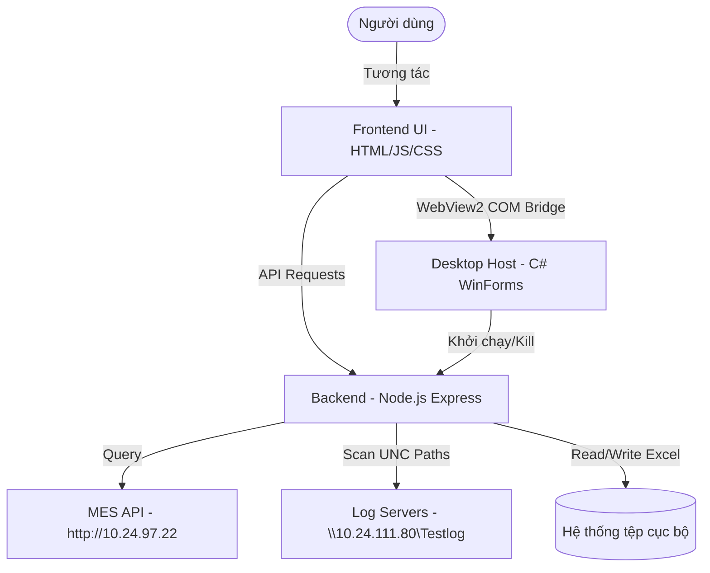

# Hướng dẫn Phát triển cho AI Agent (AGENT.md)

Tài liệu này cung cấp hướng dẫn lập trình, cấu trúc thư mục, kiến trúc hệ thống và các quy tắc phát triển quan trọng dành riêng cho các AI Agent khi làm việc trên dự án **CloudMetrics**.

---

## 🗺️ 1. Kiến trúc Hệ thống (System Architecture)

CloudMetrics là một ứng dụng lai kết hợp giữa Desktop và Web, bao gồm:
1. **Desktop Host (C# WinForms + WebView2)**: Đóng gói giao diện, quản lý vòng đời ứng dụng và cung cấp các tương tác native với hệ điều hành Windows.
2. **Backend (Node.js + Express)**: Đóng vai trò máy chủ trung gian API cục bộ, chịu trách nhiệm xử lý các tệp Excel, truy vấn dữ liệu MES API, và quét tìm các file log vật lý.
3. **Frontend UI (HTML, CSS, JS thuần)**: Giao diện người dùng tương tác, chạy bên trong trình bao WebView2.



---

## 📁 2. Cấu trúc Thư mục & Liên kết Junctions

Để thuận tiện cho việc phát triển và tương thích ngược, dự án sử dụng các **Windows Directory Junctions (Symlinks)** tại thư mục gốc trỏ trực tiếp vào các tài nguyên backend nằm trong thư mục `app/backend/`.

### Sơ đồ ánh xạ thư mục:
* `config` 🔗 trỏ tới [app/backend/config/](file:///c:/Users/PC/Downloads/clca/app/backend/config)
* `ui` 🔗 trỏ tới [ui/](file:///c:/Users/PC/Downloads/clca/ui) (Thư mục giao diện Web tĩnh được Express phục vụ trực tiếp)
* `MES API` 🔗 trỏ tới [app/backend/modules/mes-daily/](file:///c:/Users/PC/Downloads/clca/app/backend/modules/mes-daily) (Nghiệp vụ cốt lõi của MES Daily)
* `routes` 🔗 trỏ tới [app/backend/routes/](file:///c:/Users/PC/Downloads/clca/app/backend/routes) (Định tuyến API Express)
* `services` 🔗 trỏ tới [app/backend/services/](file:///c:/Users/PC/Downloads/clca/app/backend/services) (Các hàm tiện ích/hỗ trợ backend)

> [!IMPORTANT]
> Khi Agent muốn chỉnh sửa các file cấu hình, route, dịch vụ hoặc giao diện, **hãy luôn thao tác qua các Junctions ở root** hoặc đường dẫn vật lý thực tế để tránh mất mát dữ liệu hoặc không đồng bộ.

---

## ⚙️ 3. Cấu hình Hệ thống (Configurations)

Tất cả các cấu hình của hệ thống được lưu ở dạng tệp JSON tại thư mục `config/` (vật lý: `app/backend/config/`):

1. **[app.settings.json](file:///c:/Users/PC/Downloads/clca/app/backend/config/app.settings.json)**:
   - `server`: Định nghĩa IP (`host`) và Cổng (`port`, mặc định `5000`) chạy server Node.js.
   - `upload`: Dung lượng file tối đa cho phép upload (`maxFileSizeMb`, mặc định `50MB`).
   - `quicklog`: Cấu hình dung lượng cache và dung lượng sai lệch thời gian cho phép khi quét file log (`logTimeToleranceSeconds`).
2. **[quicklog.models.json](file:///c:/Users/PC/Downloads/clca/app/backend/config/quicklog.models.json)**:
   - Danh sách các model được hỗ trợ quét log (`models` - ví dụ `VO0301`).
   - Cấu hình thông tin API MES Trace (`mesTrace`).
   - Sơ đồ ánh xạ tên cột CSV mặc định (`csvMappers`) và tên các trạm kiểm tra (`stationsList`).
3. **[quicklog.local-stations.json](file:///c:/Users/PC/Downloads/clca/app/backend/config/quicklog.local-stations.json)** *(nếu có)*:
   - Dùng để cấu hình bật/tắt quyền kiểm tra log cục bộ của từng trạm và thiết lập bí danh (Station Aliases).
4. **[logging.json](file:///c:/Users/PC/Downloads/clca/app/backend/config/logging.json)**:
   - Quản lý cơ chế ghi log backend (`cloudmetrics.log`). Hỗ trợ cấu hình mức độ ghi log (`level`), thư mục log, và xoay vòng log tự động (`maxFileSizeMb`, `maxFiles`).
5. **[modules.json](file:///c:/Users/PC/Downloads/clca/app/backend/config/modules.json)**:
   - Bật/tắt các phân hệ tính năng trên giao diện thanh Menu (`clca`, `mesdaily`, `quicklog`).
6. **[clca.settings.json](file:///c:/Users/PC/Downloads/clca/app/backend/config/clca.settings.json)**:
   - Quy tắc lọc trạm CLCA đặc thù (Ví dụ: `stationRules` quy định trạm `Leak Test01` sẽ được để trống thông tin SN và Description).
7. **[mesdaily.settings.json](file:///c:/Users/PC/Downloads/clca/app/backend/config/mesdaily.settings.json)**:
   - Định nghĩa giờ chốt ca (`defaultHour`) và các tiền tố báo cáo xuất ra.
8. **[stations.json](file:///c:/Users/PC/Downloads/clca/app/backend/config/stations.json)**:
   - Chứa danh sách các trạm master và các nhóm preset trạm test (SMT, DIP, FATP) dùng cho CLCA.

---

## 🛰️ 4. Sơ đồ Định tuyến API Backend (Routing map)

Backend Express được khởi chạy từ tệp [server.js](file:///c:/Users/PC/Downloads/clca/server.js). Nó đăng ký các định tuyến thông qua các file định tuyến mô-đun trong [routes/](file:///c:/Users/PC/Downloads/clca/routes):

### 1. Phân hệ CLCA Generator (`routes/clca.routes.js`)
* **`POST /api/generate`**: Nhận file excel thô từ client, thực thi công cụ kết xuất báo cáo mẫu Excel (`Sample.xlsx`). Hỗ trợ xuất gộp nhiều file WO (`mergeAllWo`).
* **`POST /api/clca/precheck`**: Kiểm tra trước cấu trúc cột dữ liệu trong file Excel tải lên.
* **`POST /api/inspect-model`**: Đọc nhanh cột `MODEL_NAME` từ file dữ liệu Excel.
* **`POST /api/inspect-stations`**: Trích xuất các trạm test thực tế trong file Excel và so khớp với danh sách trạm đã đăng ký trên hệ thống.
* **`GET /api/stations`**: Trả về danh sách trạm master và các presets.

### 2. Phân hệ MES Daily Report (`routes/mesdaily.routes.js`)
* **`POST /api/generate/mesdaily`**: Gọi nghiệp vụ MES Daily Logic để truy vấn dữ liệu B005 & B006 từ MES API, lọc trùng lặp và ghi vào biểu mẫu Excel.
* **`POST /api/mesdaily/r001-search`**: Truy tìm dữ liệu lịch sử đầu vào theo thời gian và WO bằng command R001.

### 3. Phân hệ QuickLog (`routes/quicklog.routes.js`)
* **`GET /api/quicklog/models`**: Trả về danh sách models cấu hình.
* **`GET /api/quicklog/modes`**: Trả về danh sách chế độ chạy (PROD, QA, v.v.).
* **`GET /api/quicklog/stations`**: Quét thư mục vật lý để tìm các thư mục trạm có sẵn.
* **`POST /api/quicklog/search`**: Tìm kiếm tệp log trong thư mục UNC dựa trên SN, Mode, và Fixture.
* **`POST /api/quicklog/open-log`**: Sử dụng lệnh hệ điều hành Windows (`cmd.exe /c start`) để mở trực tiếp file log đã tìm thấy trên máy tính.
* **`POST /api/quicklog/mes-trace/search`**: Thực thi MES Trace để tra cứu lịch sử hành trình sửa chữa của SN thông qua API MES.
* **`POST /api/quicklog/mes-trace/open-log`**: Ánh xạ từ thông tin lịch sử MES để tìm và mở file log tương ứng ở thư mục mạng cục bộ.

---

## 🛠️ 5. Hướng dẫn Biên dịch và Vận hành (Compilation & Run)

### Vận hành Server Node.js độc lập:
1. Đảm bảo đã ở thư mục gốc của dự án.
2. Cài đặt các thư viện:
   ```powershell
   npm install
   ```
3. Khởi động server backend Express:
   ```powershell
   node server.js
   ```
   *Server mặc định lắng nghe trên cổng `5000` (`http://localhost:5000`).*

### Biên dịch Desktop Host (CloudMetrics.exe):
Trình bao C# Desktop Host được biên dịch trực tiếp từ mã nguồn [ClcaDesktopHost.cs](file:///c:/Users/PC/Downloads/clca/desktop-host/ClcaDesktopHost.cs).

1. Mở terminal Windows PowerShell.
2. Kiểm tra xem trình biên dịch C# (`csc.exe`) của .NET Framework đã được đăng ký trong PATH hoặc sử dụng đường dẫn đầy đủ của nó (ví dụ: `C:\Windows\Microsoft.NET\Framework64\v4.0.30319\csc.exe`).
3. Chạy lệnh biên dịch sau tại thư mục gốc:
   ```powershell
   csc.exe /target:winexe /out:"CloudMetrics.exe" /win32icon:"ui new\clca_icon_multi.ico" /reference:Microsoft.Web.WebView2.Core.dll /reference:Microsoft.Web.WebView2.WinForms.dll /reference:System.dll /reference:System.Drawing.dll /reference:System.Windows.Forms.dll /win32manifest:desktop-host\app.manifest desktop-host\ClcaDesktopHost.cs
   ```
4. Khi chạy tệp thực thi `CloudMetrics.exe`, **bắt buộc** phải giữ các file sau ở cùng thư mục:
   - `Microsoft.Web.WebView2.Core.dll`
   - `Microsoft.Web.WebView2.WinForms.dll`
   - `WebView2Loader.dll`
   - Thư mục `runtime/node/node.exe` (để ứng dụng tự khởi chạy server ngầm cục bộ nếu máy không cài sẵn node) hoặc server sẽ tự động fallback sang lệnh `node` của hệ thống.

---

## 💡 6. Các cơ chế hoạt động đặc thù cần lưu ý

1. **COM Bridge (`clcaHost`)**:
   - WebView2 cung cấp đối tượng cầu nối COM đồng bộ `window.chrome.webview.hostObjects.sync.clcaHost` sang mã nguồn C#.
   - Phương thức `BrowseSave(defaultFileName)` được sử dụng để hiển thị hộp thoại "Save As" nguyên bản của Windows. Nó chạy trên một luồng đơn STA (Single Threaded Apartment) được quản lý trong C# để tránh xung đột với luồng giao diện chính.
2. **Cơ chế phân đoạn ngày của MES API (Daily Chunks)**:
   - API MES (`B005`/`B006`) bị giới hạn hiệu năng khi truy vấn lượng dữ liệu cực lớn trong dải ngày dài.
   - Để giải quyết vấn đề timeout hoặc tràn bộ nhớ, backend chia nhỏ khoảng thời gian truy vấn thành các phân đoạn 2 ngày (`getDailyDateChunks` tại [logic.js](file:///c:/Users/PC/Downloads/clca/app/backend/modules/mes-daily/logic.js#L138)) và thực hiện tải dữ liệu cuốn chiếu.
3. **Cơ chế Quét Log UNC (QuickLog)**:
   - Log kiểm tra vật lý thường nằm ở thư mục mạng dùng chung (ví dụ `\\10.24.111.80\Testlog\camera\VO0301\SYNC LOCAL DATA\`).
   - Việc tìm kiếm log dựa vào sự kết hợp giữa **Mã SN của sản phẩm**, **Thời gian kết thúc trạm kiểm tra (EndTime)** và **Trạng thái Pass/Fail**.
   - Thời gian log được quét khớp bằng cách so sánh timestamp trong tên file hoặc thời gian sửa đổi file vật lý (`mtime`/`ctime`) với `EndTime` thực tế của MES, cho phép sai lệch tối đa theo cấu hình `logTimeToleranceSeconds`.

---

## 🚫 7. Quy tắc lập trình và phát triển dành cho Agent

1. **Không phá vỡ các Comments & Docstrings cũ**: Hãy luôn bảo toàn các chú thích code hiện có trừ khi được yêu cầu sửa đổi trực tiếp các hàm đó.
2. **Quản lý Vòng đời & Crash Server**: Luôn duy trì các hàm xử lý sự kiện `uncaughtException` và `unhandledRejection` tại đầu file `server.js` để tránh việc backend crash làm tắt toàn bộ ứng dụng desktop của người dùng.
3. **Thao tác UI**: Khi chỉnh sửa giao diện Frontend, chỉ sửa đổi các file trong thư mục `ui/` (`app.js`, `index.html`, `styles.css`). Tránh đưa các tài nguyên bên ngoài không cần thiết vào dự án.
4. **Không sử dụng placeholders**: Khi cần demo hoặc thiết kế hình ảnh, hãy dùng các công cụ thực tế hoặc sinh ảnh đúng mục đích sử dụng.
5. **Đọc kỹ tệp cấu hình**: Luôn kiểm tra xem tệp cấu hình JSON tương ứng có tồn tại không trước khi đọc/ghi, và đảm bảo bắt lỗi (`try-catch`) khi phân tích cú pháp JSON để ứng dụng có thể tự hồi phục bằng các giá trị mặc định (`fallback defaults`).
6. **Lỗi trắng trang (Mất UI module)**: Nếu ứng dụng Desktop khởi chạy bình thường nhưng giao diện trắng bóc, không load được các module trên `index.html`, **NGUYÊN NHÂN THƯỜNG LÀ DO LỖI CÚ PHÁP (Syntax Error) TRONG `ui/app.js`**. Vì giao diện được render chủ yếu qua JavaScript, một lỗi thiếu dấu ngoặc sẽ làm toàn bộ script ngừng chạy. Hãy luôn chạy lệnh `node -c ui/app.js` để kiểm tra cú pháp sau khi thực hiện các thay đổi lớn (như xoá khối lệnh) bằng công cụ `replace_file_content`.
